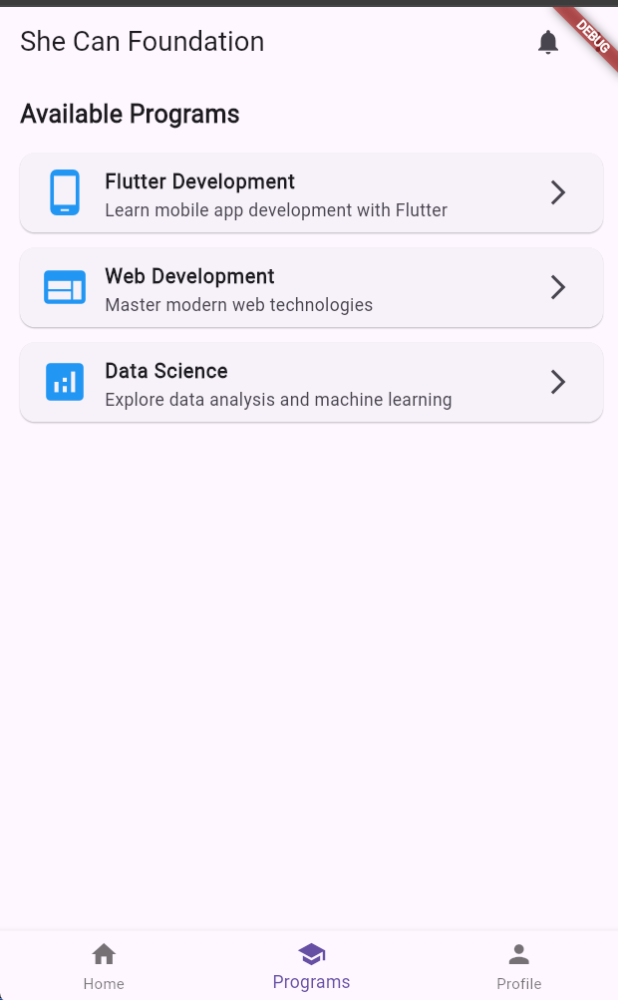

# She Can Foundation - Flutter App

A well-structured Flutter application built to demonstrate a complete user authentication flow and dashboard interface. This project serves as a template for a multi-page mobile app, featuring a splash screen, login, registration, and a functional dashboard with bottom navigation.




*(Suggestion: Replace the placeholder above with a real screenshot or GIF of your running application.)*

---

## 🌟 Key Features

*   **Splash Screen:** An initial loading screen that navigates to the login page.
*   **User Authentication:** Fully featured Login and Registration pages.
*   **Form Validation:** Robust client-side validation for all input fields (email format, password length, required fields).
*   **Dashboard:** A secure area accessible after login, featuring:
    *   **Bottom Navigation:** Easy switching between Home, Programs, and Profile tabs.
    *   **User Profile:** A dedicated page to display user information.
    *   **Logout Functionality:** Securely log out and return to the login screen.
*   **Reusable Widgets:** Custom, reusable components for buttons and text fields to ensure UI consistency.
*   **Clean Navigation:** Named routes for clear, maintainable, and easy-to-understand navigation logic.
*   **Professional UI:** A clean, modern, and responsive user interface.

---

## 📂 Project Structure

The project follows best practices for separation of concerns, making the codebase clean and scalable.

```
lib/
├── main.dart                 # App entry point and route configuration
├── screens/
│   ├── splash_screen.dart    # Initial loading screen
│   ├── login_page.dart       # User login screen
│   ├── register_page.dart    # User registration screen
│   └── dashboard_page.dart   # Main dashboard with bottom navigation
└── widgets/
    ├── custom_button.dart    # Reusable styled button
    └── custom_text_field.dart  # Reusable and enhanced text field
```

---

## 🛠️ Getting Started

Follow these instructions to get a copy of the project up and running on your local machine for development and testing.

### Prerequisites

You need to have the Flutter SDK installed on your machine. For instructions, see the [official Flutter documentation](https://flutter.dev/docs/get-started/install).

### Installation & Setup

1.  **Clone the repository:**
    ```sh
    git clone https://github.com/13harshit/She-can-foundation.git
    ```

2.  **Navigate to the project directory:**
    ```sh
    cd She-can-foundation
    ```

3.  **Install dependencies:**
    ```sh
    flutter pub get
    ```

4.  **Run the application:**
    ```sh
    flutter run
    ```

---

## 🤝 How to Contribute

Contributions are what make the open-source community such an amazing place to learn, inspire, and create. Any contributions you make are **greatly appreciated**.

If you have a suggestion that would make this better, please fork the repo and create a pull request. You can also simply open an issue with the tag "enhancement".

1.  Fork the Project
2.  Create your Feature Branch (`git checkout -b feature/AmazingFeature`)
3.  Commit your Changes (`git commit -m 'Add some AmazingFeature'`)
4.  Push to the Branch (`git push origin feature/AmazingFeature`)
5.  Open a Pull Request

---

## 📄 License

This project is open-source and available to everyone. You are free to use, modify, and distribute it. If you build upon it, a little credit back to the original repository would be appreciated but is not required.
